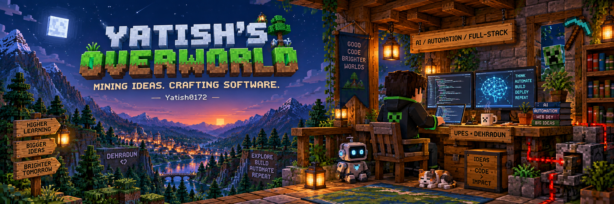

<p align="center">
  
</p>

<p align="center">
  
</p>

<p align="center">
  <a href="mailto:YATISH0172@GMAIL.COM">
    
  </a>
  <a href="https://github.com/Yatish0172?tab=repositories">
    
  </a>
</p>

---
## 🧑 Player Info

```yaml
player: Yatish Sharma
spawn_point: UPES, Dehradun
class: Computer Science Student
biomes:
  - Artificial Intelligence
  - Automation
  - Full-Stack Development
playstyle: Learn by building
```

I turn ideas into useful software, one block at a time.
Usually exploring a new concept, connecting systems,
or figuring out why the build worked five minutes ago.

## 🛠️ Languages & Tools

<p align="center">
  
  
  
</p>

<p align="center">
  
  
  
  
</p>

<p align="center">
  
  
  
</p>

---
## 🛠️ Crafting Table

| Ingredient | Ingredient | Crafted Item |
| :---: | :---: | :---: |
| 🧠 Curiosity | 🐍 Python | AI experiments |
| 🎨 Interface | ⚙️ Backend | Full-stack applications |
| 🔁 Repetitive task | 💡 A little code | Automation |
| 🐛 Bug | ☕ Persistence | A lesson learned |

## 🧭 Quest Board

- 🟢 **Main quest:** Build software that solves everyday problems.
- 🟡 **Side quest:** Explore AI and automation.
- 🔵 **Exploration:** Connect better interfaces with useful backends.
- 🟣 **Ongoing quest:** Understand the things I build.

## 💎 XP & World Stats

<div align="center">


<sub>These are GitHub activity stats. Actual diamond count remains classified.</sub>

</div>

---

<div align="center">

## 🏕️ Join the Campfire

Have an idea? Found something interesting? Let's talk.

**[📨 Send a message](mailto:YATISH0172@GMAIL.COM)**

<br />

**Keep exploring. Keep crafting. Save your progress.**

🟫 🟩 🟫 🟩 🟫 🟩 🟫 🟩 🟫 🟩 🟫 🟩

</div>
